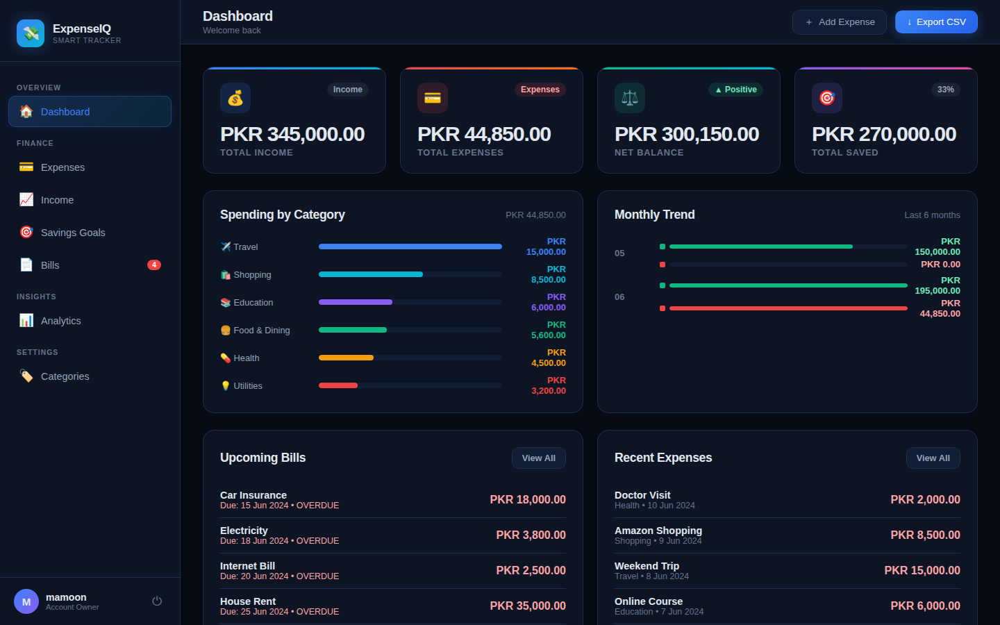
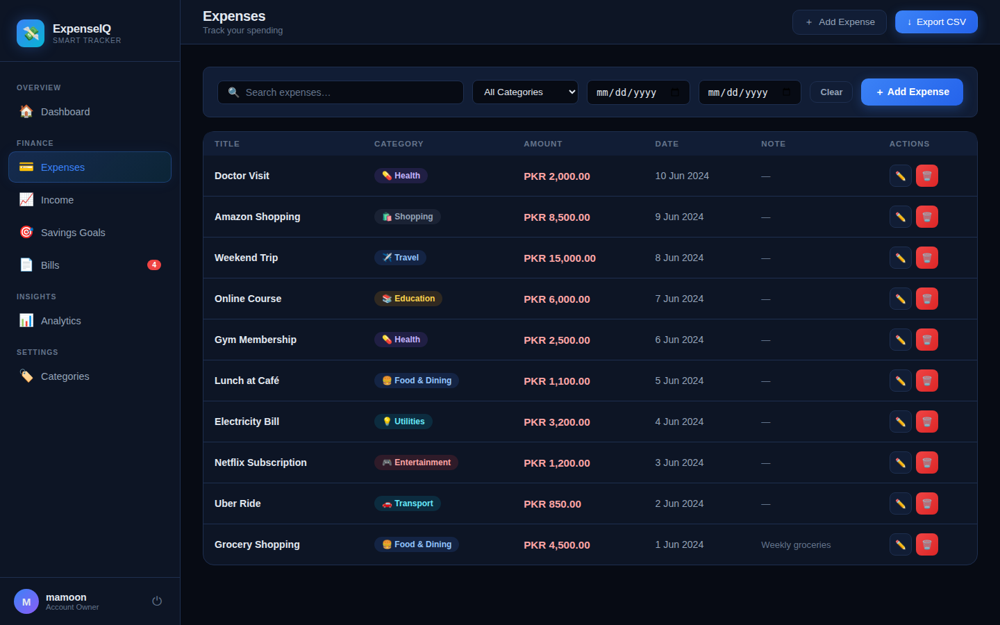
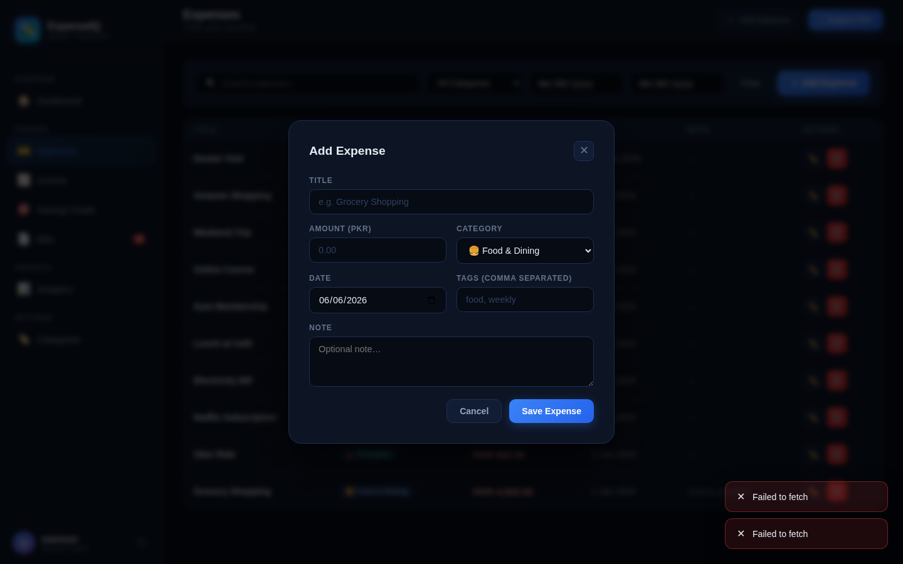
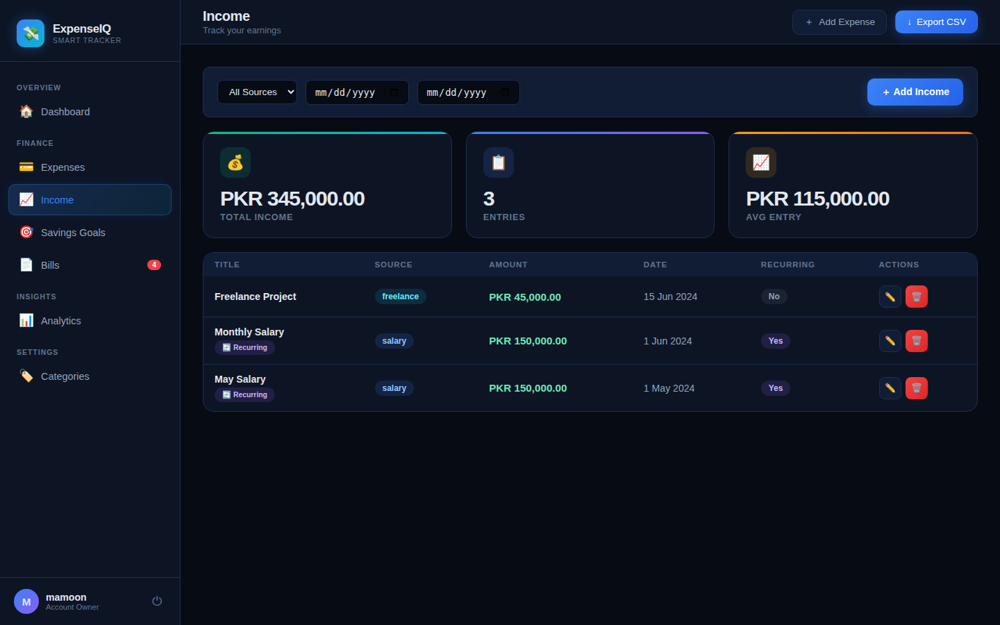
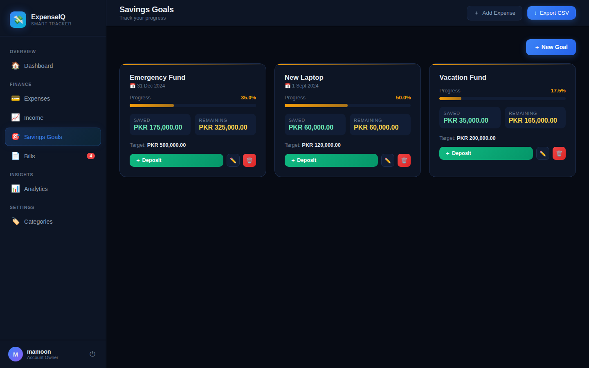
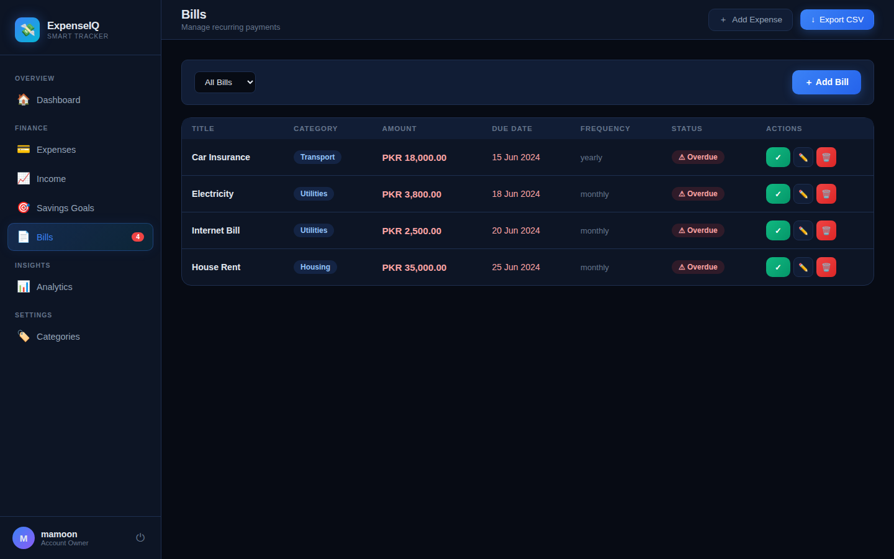
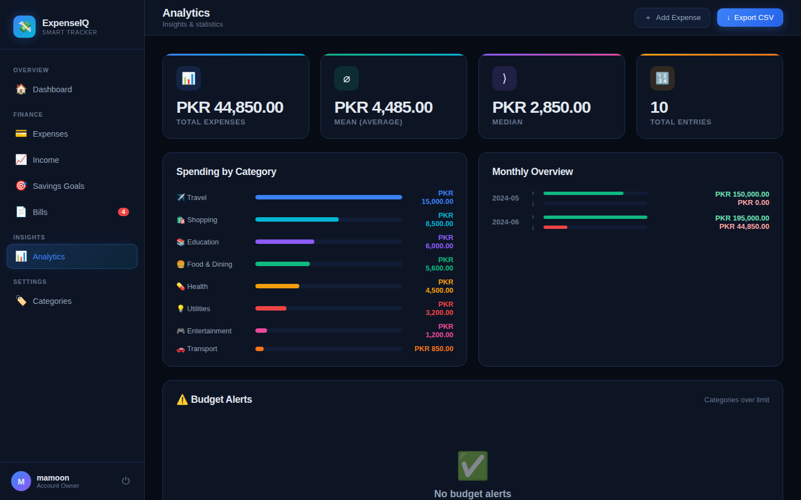
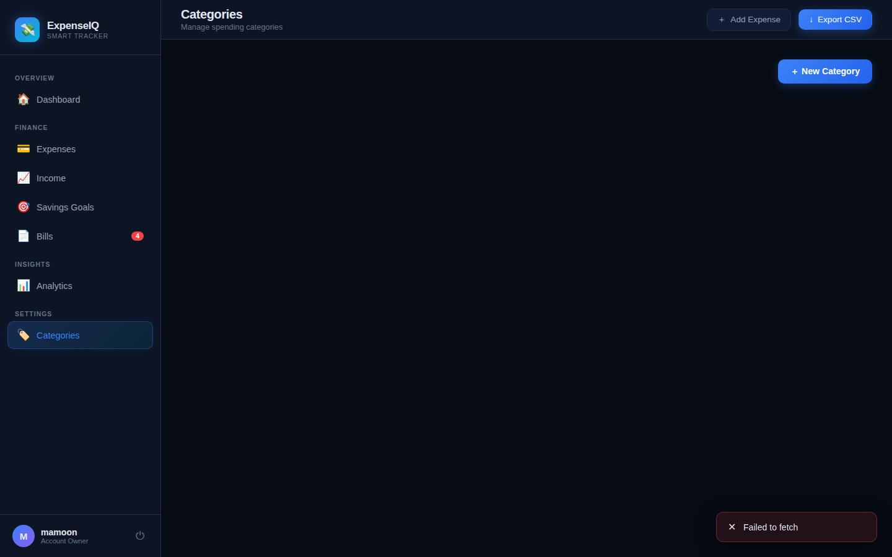

# 💸 Smart Expense Tracker

> A production-ready, **file-based** expense tracking REST API + **Dark Modern UI** built with **FastAPI** & pure HTML/CSS/JS — no database, no build tools required.

[](https://www.python.org/)
[](https://fastapi.tiangolo.com/)
[](LICENSE)

---

## 📸 Screenshots

### Login Page


### Dashboard


### Expenses


### Add Expense Modal


### Income


### Savings Goals


### Bills


### Analytics


### Categories


---

## ✨ Features

| Module | Capabilities |
|---|---|
| 🔐 **Auth** | Register, login, JWT tokens, bcrypt password hashing |
| 💰 **Expenses** | Full CRUD, filter by category/date/amount/search, CSV export |
| 📈 **Income** | Multiple sources (salary, freelance, business…), monthly summary |
| 🎯 **Savings** | Goal tracking, deposit endpoint, progress % and remaining amount |
| 📄 **Bills** | Due date tracking, mark paid/unpaid, overdue alerts |
| 📊 **Analytics** | Mean, median, mode, min/max, category breakdown, monthly breakdown |
| 🖥 **Dashboard** | Single endpoint — income, expenses, net balance, savings, top category |
| 🔔 **Budget Alerts** | Per-category spending limits with severity levels |
| 📤 **CSV Export** | Download all expenses as a `.csv` file |
| 🎨 **Dark UI** | Responsive dark dashboard — no build tools, pure HTML/CSS/JS |

---

## 🛠 Tech Stack

- **Python 3.10+**
- **FastAPI** — modern async web framework
- **Uvicorn** — ASGI server
- **Pydantic v2** — data validation & serialization
- **python-jose** — JWT token generation & verification
- **passlib + bcrypt** — secure password hashing
- **Python `statistics` module** — built-in analytics
- **JSON files** — zero-dependency persistent storage
- **Pure HTML/CSS/JS** — frontend with no build step

---

## 📁 Project Structure

```
smart-expense-tracker/
├── app/
│   ├── main.py
│   ├── core/
│   │   ├── config.py
│   │   ├── security.py
│   │   └── file_db.py
│   ├── schemas/
│   ├── routes/
│   │   ├── auth.py
│   │   ├── expenses.py
│   │   ├── income.py
│   │   ├── savings.py
│   │   ├── bills.py
│   │   ├── analytics.py
│   │   └── categories.py
│   └── services/
│       └── analytics_service.py
├── frontend/
│   ├── login.html
│   └── dashboard.html
├── data/               ← JSON storage (auto-created)
├── screenshots/        ← UI screenshots
├── tests/
├── requirements.txt
├── .env.example
└── README.md
```

---

## 🚀 Installation & Running

```bash
git clone https://github.com/muhammadmamoon/smart-expense-tracker.git
cd smart-expense-tracker

python -m venv venv && source venv/bin/activate
pip install -r requirements.txt
cp .env.example .env

uvicorn app.main:app --reload
```

| URL | Description |
|-----|-------------|
| `http://127.0.0.1:8000` | Login / Register UI |
| `http://127.0.0.1:8000/app` | Main Dashboard |
| `http://127.0.0.1:8000/docs` | Swagger API docs |

---

## 👤 Author

**Muhammad Mamoon**

---

## 📄 License

Copyright © 2024 Muhammad Mamoon — [MIT License](LICENSE)
